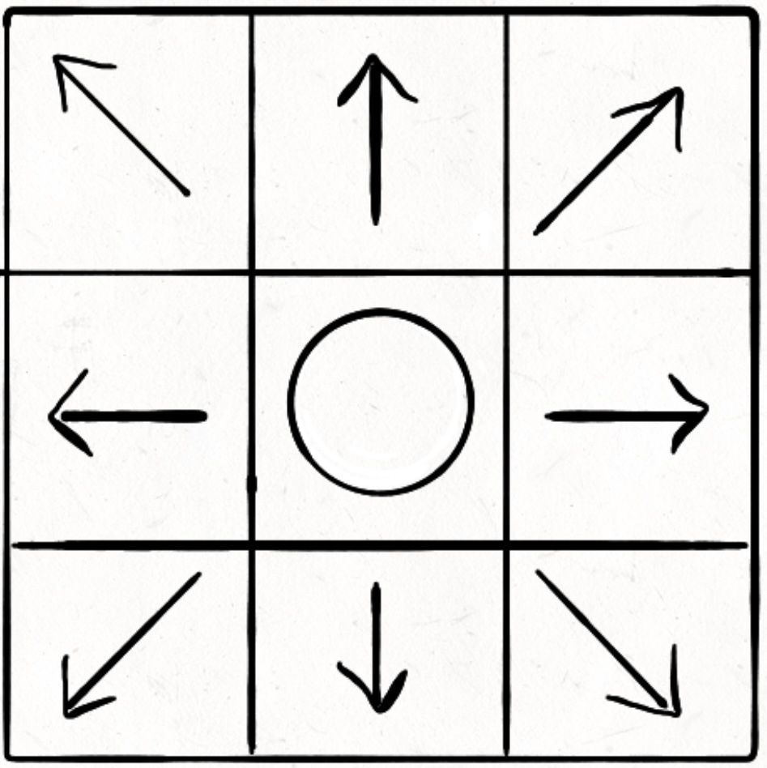

# 介绍

​	本项目为个人学习寻路算法时实现的一个小项目，为了能够更好地理解各种寻路算法，并且将算法可视化出来也非常的有趣。本项目使用Unity来实现寻路算法的可视化，包含**BFS**、**DFS**、**Dijkstra**、**最佳优先搜索**、**A\***。

效果如下：

BFS：

 

DFS：

 

BestFirstSearch：

 

Dijkstra：

 

A*：

 

# 使用	

## Release版本

​	你可以直接下载release版本：

 

左边可以通过点击不同的按钮来调用不同的寻路算法，右边可以输入开始和结束结点的坐标，输入范围为[0, 29]，地图默认大小为30\*30。

 

## 编辑器

​	你也可以直接在编辑器中打开项目：

 

​	在编辑器中你可以自由地设置地图和结点的信息：

- 地图信息：你可以设置地图的大小，默认为30\*30
- 结点信息：你可以设置每一个结点的大小，还有开始和结束结点的坐标，默认左下角为坐标原点。
- 可视化结点信息：你可以设置可视化算法时运行的速度和结点的颜色
  - Visual Speed：算法运行的速度
  - Start Node Color：开始结点的颜色
  - End Node Color：结束结点的颜色
  - Wall Color：墙的颜色
  - Has Visited Color：已经处理完毕的结点的颜色
  - Outside Color：访问过但还未处理完的结点的颜色，即最外层结点的颜色
  - Path Color：最终起点到终点的路径的颜色

 

​	如果你先要修改墙的位置，那就在编辑器中框选结点，然后在Inspector面板中设置结点的类型（Type）即可，你需要设置**Wall（墙）**、**HasNotVisited（也就是白色结点**）、**Start（开始结点）**和**End（结束结点）**即可：

 

# 脚本

​	下面是所有的游戏脚本：

 

## Algorithm文件夹

​	里面是各种寻路算法的实现源码，这里提供了优先级队列的泛型实现，供这些寻路算法使用。所有寻路算法都继承于接口ISelectAlgorithm，使得调用算法变得更加方便。

 

更多的算法实现细节请见此文章：https://www.yuque.com/docs/share/7f2e46b5-37ac-47cf-948f-abf6e6e111e0?#

 

## Map文件夹

​	这里面主要是地图和结点的实现，Node脚本是结点的各种信息，它挂载在预制体上。它包含了结点的颜色类型、结点的代价值、结点的坐标等等，它需要实现CompareTo函数，用于在优先级队列中排序。

​	Map脚本是地图的实现脚本，包含地图的初始化、面板数据显示、结点的可视化等函数，里面还提供了一些用于寻路算法的函数和数据结构：

- `List<List<int>> directions8`：方向数组，决定结点每次可访问的邻接结点的数量，8表示与结点相邻的8个结点都可以访问到：

- `List<List<int>> directions4`：同上，不过只能访问四个方向的结点：

- `List<Node> Neighbor(Node node, List<List<int>> directions)`：访问某个结点的所有邻居结点，第一个参数为结点；第二个参数为访问的方向，即使用上面的两个方向数组决定访问的方向；返回值为存放所有邻居结点的列表。

  在外部的访问方式：`Map.Instance.Neighbor(node, Map.Instance.direction8)`

- `void AddVisualStep(Node node, NodeType nodeType)`：将结点加入到可视化列表中，第一个参数为结点，第二个参数为可视化时结点的颜色类型。这里解释一下，可视化寻路算法的方式就是在执行各种寻路算法的时候将遍历到的每一个结点都加入到一个可视化的列表中，该列表中存储每一个结点和它们可视化时的颜色信息。在算法结束后，使用协程将这个列表打印出来，这样就实现了算法的可视化。

 

## UI文件夹

​	这个文件夹主要是UI界面的控制脚本。包含对按钮和InputField对象的控制。

 

## 插件

​	本项目使用了插件SimpleGridShader，为了让地图显示出网格的样子。
